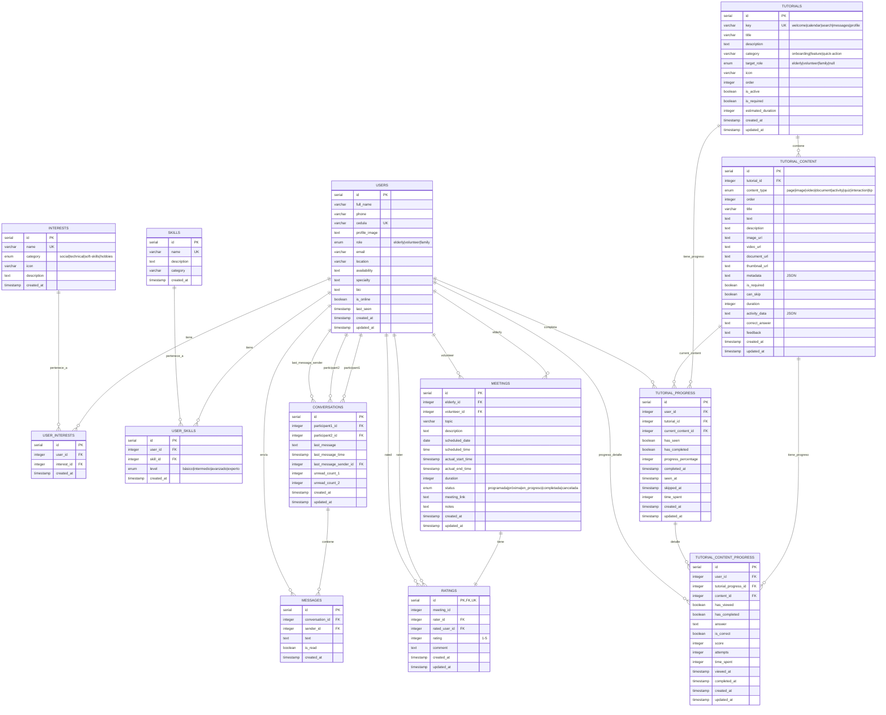

# Esquema de Base de Datos - Abuelos Digitales

## Diagrama ER (Entity Relationship)



## Descripción de las Relaciones

### Relaciones Many-to-Many

1. **USERS ↔ INTERESTS** (a través de `USER_INTERESTS`)
   - Un usuario puede tener múltiples intereses
   - Un interés puede pertenecer a múltiples usuarios

2. **USERS ↔ SKILLS** (a través de `USER_SKILLS`)
   - Un usuario (voluntario) puede tener múltiples habilidades
   - Una habilidad puede ser poseída por múltiples usuarios
   - Incluye nivel de habilidad (básico, intermedio, avanzado, experto)

### Relaciones One-to-Many

1. **USERS → CONVERSATIONS**
   - Un usuario puede ser participant1 en múltiples conversaciones
   - Un usuario puede ser participant2 en múltiples conversaciones
   - Un usuario puede ser el último remitente de múltiples conversaciones

2. **CONVERSATIONS → MESSAGES**
   - Una conversación puede tener múltiples mensajes
   - Cada mensaje pertenece a una conversación

3. **USERS → MESSAGES**
   - Un usuario puede enviar múltiples mensajes
   - Cada mensaje tiene un remitente

4. **USERS → MEETINGS**
   - Un usuario (elderly) puede tener múltiples reuniones
   - Un usuario (volunteer) puede tener múltiples reuniones

5. **MEETINGS → RATINGS**
   - Una reunión puede tener una calificación (relación única)
   - Cada calificación pertenece a una reunión

6. **USERS → RATINGS**
   - Un usuario puede dar múltiples calificaciones (rater)
   - Un usuario puede recibir múltiples calificaciones (rated)

7. **TUTORIALS → TUTORIAL_CONTENT**
   - Un tutorial puede tener múltiples elementos de contenido (páginas, imágenes, videos, etc.)
   - Cada elemento de contenido pertenece a un tutorial
   - Los elementos tienen un orden específico

8. **TUTORIALS → TUTORIAL_PROGRESS**
   - Un tutorial puede tener múltiples registros de progreso (uno por usuario)
   - Cada registro de progreso pertenece a un tutorial específico

9. **TUTORIAL_CONTENT → TUTORIAL_PROGRESS**
   - Un elemento de contenido puede ser el contenido actual de un progreso
   - Relación opcional para trackear dónde está el usuario

10. **TUTORIAL_CONTENT → TUTORIAL_CONTENT_PROGRESS**
    - Un elemento de contenido puede tener múltiples registros de progreso (uno por usuario)
    - Cada registro trackea el progreso detallado de ese contenido específico

11. **TUTORIAL_PROGRESS → TUTORIAL_CONTENT_PROGRESS**
    - Un progreso de tutorial puede tener múltiples registros de progreso de contenido
    - Permite trackear el progreso detallado de cada elemento

12. **USERS → TUTORIAL_PROGRESS**
    - Un usuario puede tener múltiples registros de progreso de tutoriales
    - Cada registro pertenece a un usuario

13. **USERS → TUTORIAL_CONTENT_PROGRESS**
    - Un usuario puede tener múltiples registros de progreso de contenido
    - Cada registro pertenece a un usuario

## Enums Utilizados

- **user_role**: `elderly`, `volunteer`, `family`
- **meeting_status**: `programada`, `próxima`, `en_progreso`, `completada`, `cancelada`
- **interest_category**: `social`, `technical`, `soft-skills`, `hobbies`
- **skill_level**: `básico`, `intermedio`, `avanzado`, `experto`
- **tutorial_content_type**: `page`, `image`, `video`, `document`, `activity`, `quiz`, `interaction`, `tip`

## Sistema de Contenido de Tutoriales

### Tipos de Contenido Soportados

El sistema ahora soporta múltiples tipos de contenido para cada tutorial:

1. **`page`** - Página de contenido con texto, título y descripción
   - Ejemplo: "Paso 1: Bienvenida" con texto explicativo
   - Campos: `title`, `text`, `description`

2. **`image`** - Imagen ilustrativa
   - Ejemplo: Screenshot de la interfaz, diagrama explicativo
   - Campos: `imageUrl`, `thumbnailUrl`, `description`

3. **`video`** - Video explicativo
   - Ejemplo: Video tutorial de YouTube, Vimeo, o archivo local
   - Campos: `videoUrl`, `thumbnailUrl`, `duration`, `metadata`

4. **`document`** - Documento descargable
   - Ejemplo: PDF con guía detallada, documento de referencia
   - Campos: `documentUrl`, `description`, `metadata`

5. **`activity`** - Actividad interactiva
   - Ejemplo: Ejercicio práctico, simulación
   - Campos: `activityData` (JSON), `feedback`, `duration`

6. **`quiz`** - Pregunta/quiz
   - Ejemplo: Pregunta de comprensión, evaluación
   - Campos: `activityData` (JSON), `correctAnswer`, `feedback`, `score`

7. **`interaction`** - Interacción específica
   - Ejemplo: "Haz click aquí", "Desliza para continuar"
   - Campos: `text`, `activityData` (JSON), `feedback`

8. **`tip`** - Tip o consejo destacado
   - Ejemplo: Consejo importante, recordatorio
   - Campos: `text`, `description`

### Estructura de Datos

#### Ejemplo de Tutorial Completo

```json
{
  "tutorial": {
    "key": "welcome",
    "title": "Tutorial de Bienvenida",
    "category": "onboarding",
    "content": [
      {
        "type": "page",
        "order": 1,
        "title": "¡Bienvenido!",
        "text": "Te mostraremos cómo usar la aplicación paso a paso.",
        "description": "Introducción al tutorial"
      },
      {
        "type": "image",
        "order": 2,
        "imageUrl": "/images/dashboard-overview.png",
        "description": "Vista general del dashboard"
      },
      {
        "type": "video",
        "order": 3,
        "videoUrl": "https://youtube.com/watch?v=...",
        "duration": 120,
        "description": "Video explicativo de navegación"
      },
      {
        "type": "activity",
        "order": 4,
        "title": "Prueba la navegación",
        "activityData": {
          "type": "click",
          "target": "calendar-button",
          "instructions": "Haz click en el botón de calendario"
        },
        "feedback": "¡Excelente! Ahora sabes cómo navegar."
      },
      {
        "type": "quiz",
        "order": 5,
        "title": "¿Dónde encuentras tus sesiones?",
        "activityData": {
          "question": "¿En qué sección encuentras tus sesiones programadas?",
          "options": ["Calendario", "Perfil", "Mensajes", "Búsqueda"]
        },
        "correctAnswer": "Calendario",
        "feedback": "Correcto! El calendario muestra todas tus sesiones."
      },
      {
        "type": "tip",
        "order": 6,
        "text": "💡 Tip: Puedes volver a ver este tutorial desde la sección de Ayuda"
      }
    ]
  }
}
```

### Tracking de Progreso Detallado

El sistema permite trackear:
- **Progreso general del tutorial**: `TUTORIAL_PROGRESS`
  - Porcentaje de completitud
  - Contenido actual
  - Tiempo total invertido

- **Progreso por elemento**: `TUTORIAL_CONTENT_PROGRESS`
  - Si vio cada elemento
  - Si completó actividades/quizzes
  - Respuestas y puntuaciones
  - Tiempo por elemento
  - Número de intentos

### Consultas Útiles

#### Obtener contenido de un tutorial ordenado
```sql
SELECT * FROM tutorial_content 
WHERE tutorial_id = ?
ORDER BY order;
```

#### Obtener progreso detallado de un usuario en un tutorial
```sql
SELECT 
  tc.*,
  tcp.has_viewed,
  tcp.has_completed,
  tcp.answer,
  tcp.is_correct,
  tcp.time_spent
FROM tutorial_content tc
LEFT JOIN tutorial_content_progress tcp 
  ON tc.id = tcp.content_id 
  AND tcp.user_id = ?
WHERE tc.tutorial_id = ?
ORDER BY tc.order;
```

#### Calcular porcentaje de completitud
```sql
SELECT 
  COUNT(CASE WHEN tcp.has_completed THEN 1 END) * 100.0 / COUNT(tc.id) as progress_percentage
FROM tutorial_content tc
LEFT JOIN tutorial_content_progress tcp 
  ON tc.id = tcp.content_id 
  AND tcp.user_id = ?
WHERE tc.tutorial_id = ?;
```

## Casos de Uso del Sistema de Tutoriales

### 1. Tutorial de Bienvenida (Onboarding)
- **Tutorial**: `welcome`
- **Categoría**: `onboarding`
- **Target Role**: `elderly` (solo para adultos mayores)
- **Requerido**: `true`
- **Casos de uso**:
  - Mostrar al usuario nuevo los pasos básicos de la aplicación
  - Trackear si completó el tutorial inicial
  - Permitir saltar pero marcar como "visto"

### 2. Tutoriales de Acciones Rápidas
- **Tutoriales**: `calendar`, `search`, `messages`, `profile`
- **Categoría**: `quick-action`
- **Target Role**: `elderly`
- **Requerido**: `false`
- **Casos de uso**:
  - Mostrar tutorial contextual cuando el usuario accede por primera vez a una funcionalidad
  - Guardar progreso por paso (current_step)
  - Permitir completar o saltar
  - No mostrar nuevamente si ya fue completado

### 3. Tutoriales de Funcionalidades
- **Categoría**: `feature`
- **Target Role**: `null` (todos los roles) o específico
- **Casos de uso**:
  - Explicar nuevas funcionalidades agregadas
  - Tutoriales específicos para voluntarios (ej: cómo crear sesiones)
  - Tutoriales para familiares (ej: cómo ayudar a un adulto mayor)

### 4. Gestión de Progreso
- **Tracking granular**:
  - `has_seen`: Usuario vio el tutorial (aunque no lo completó)
  - `has_completed`: Usuario completó todos los contenidos requeridos
  - `current_content_id`: Contenido actual en el que está el usuario
  - `progress_percentage`: Porcentaje de completitud (0-100)
  - `time_spent`: Tiempo total invertido en el tutorial
  - `skipped_at`: Si el usuario decidió saltar el tutorial
  - `completed_at`: Cuándo completó el tutorial

- **Tracking por elemento de contenido**:
  - `has_viewed`: Si vio el contenido específico
  - `has_completed`: Si completó el contenido (para actividades/quizzes)
  - `answer`: Respuesta del usuario (para quizzes)
  - `is_correct`: Si la respuesta es correcta
  - `score`: Puntuación obtenida
  - `attempts`: Número de intentos
  - `time_spent`: Tiempo invertido en ese contenido específico

### 5. Consultas Comunes

#### Obtener tutoriales pendientes para un usuario
```sql
SELECT t.* 
FROM tutorials t
LEFT JOIN tutorial_progress tp ON t.id = tp.tutorial_id AND tp.user_id = ?
WHERE (t.target_role IS NULL OR t.target_role = ?)
  AND t.is_active = true
  AND (tp.id IS NULL OR tp.has_completed = false)
ORDER BY t.order;
```

#### Verificar si usuario completó tutorial requerido
```sql
SELECT COUNT(*) 
FROM tutorials t
LEFT JOIN tutorial_progress tp ON t.id = tp.tutorial_id AND tp.user_id = ?
WHERE t.is_required = true
  AND (t.target_role IS NULL OR t.target_role = ?)
  AND (tp.id IS NULL OR tp.has_completed = false);
```

#### Obtener progreso de tutoriales de un usuario
```sql
SELECT 
  t.key,
  t.title,
  tp.has_seen,
  tp.has_completed,
  tp.current_step,
  tp.completed_at
FROM tutorial_progress tp
JOIN tutorials t ON tp.tutorial_id = t.id
WHERE tp.user_id = ?
ORDER BY t.order;
```

## Notas Importantes

1. **Cascadas**: Todas las relaciones tienen `onDelete: 'cascade'` para mantener la integridad referencial
2. **Unicidad**: 
   - `cedula` en USERS es único
   - `name` en INTERESTS es único
   - `name` en SKILLS es único
   - `key` en TUTORIALS es único
   - `meeting_id` en RATINGS es único (una calificación por reunión)
   - Combinación `tutorial_id` + `order` en TUTORIAL_CONTENT debería ser única (o usar índice único)
3. **Timestamps**: Todas las tablas principales tienen `created_at` y `updated_at` para auditoría
4. **Estado en línea**: Los usuarios tienen `is_online` y `last_seen` para tracking de presencia
5. **Sistema de Tutoriales**:
   - Los tutoriales se definen centralmente en la tabla `tutorials`
   - Cada tutorial puede tener múltiples elementos de contenido (`tutorial_content`)
   - Soporta diferentes tipos de contenido: páginas, imágenes, videos, documentos, actividades, quizzes, etc.
   - El progreso general se trackea en `tutorial_progress`
   - El progreso detallado por elemento se trackea en `tutorial_content_progress`
   - Permite tutoriales requeridos vs opcionales
   - Soporta diferentes roles y categorías de tutoriales
   - Tracking granular de tiempo, respuestas, puntuaciones y intentos
